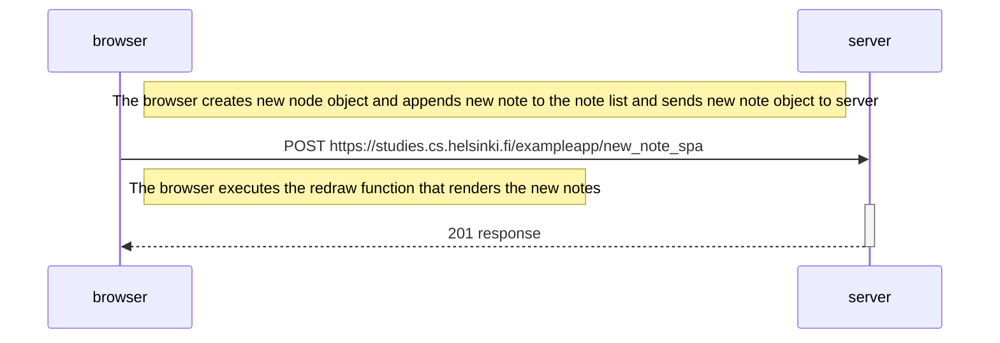

```mermaid
  
sequenceDiagram
    participant browser
    participant server

    Note right of browser: The browser creates new node object and appends new note to the note list and sends new note object to server 
    browser->>server: POST https://studies.cs.helsinki.fi/exampleapp/new_note_spa
    Note right of browser: The browser executes the redraw function that renders the new notes
    activate server
    server-->>browser: 201 response
    deactivate server
```